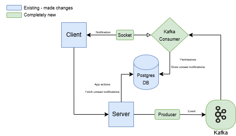

# LineApp Alerts Architecture

This repository contains the architecture and implementation of the **LineApp Alerts** system.

## 📄 Overview

The system enables real-time notifications and data processing between a client application and backend services using Kafka, Postgres, and socket communication.

## 🖼️ Architecture Diagram

[Download draw.io source file](LineAppAlerts.drawio)

## 🧩 Components

| Component         | Description                                                                 |
|------------------|-----------------------------------------------------------------------------|
| **Client**       | The user-facing interface that connects via a socket for live updates.     |
| **Server**       | Processes requests, writes/reads from db and emits events via producer.     |
| **Producer**     | Publishes new notifications and events to the Kafka broker.                |
| **Kafka Consumer**| Consumes events from Kafka and sends them as Notifications to connected clients.       |
| **Postgres DB**  | Stores persistent data like notifications, user preferences and regular LineApp data.     |

## 🚀 How It Works

1. The client connects to the server over a socket connection.
2. The server consumes and publishes events via Kafka.
3. Kafka Consumer processes messages and updates the database.
4. Clients receive notifications in real-time over the socket.
